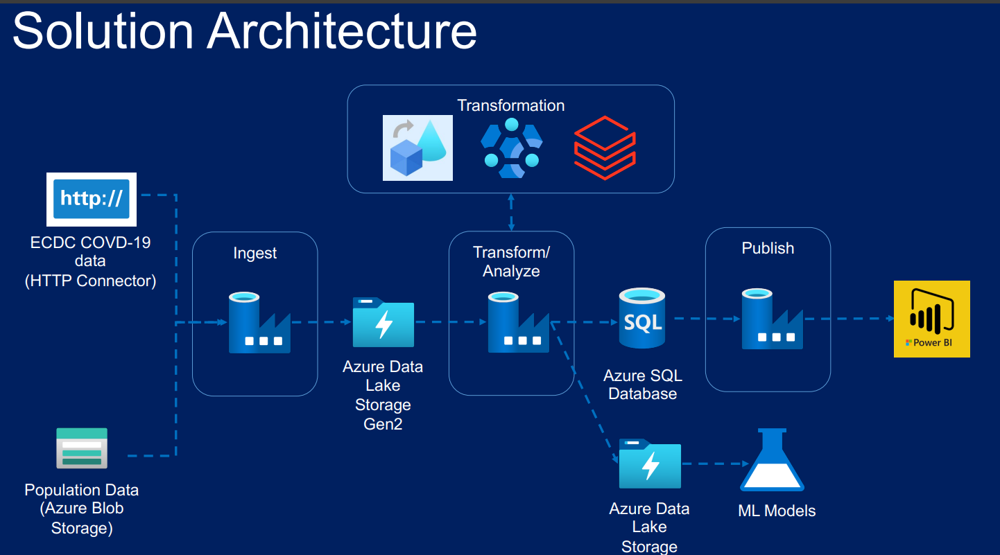

# COVID-19 Reporting Data Engineering Project

## Project Overview

This project demonstrates the design and implementation of an end-to-end Azure Data Engineering pipeline for COVID-19 reporting. The solution automates the ingestion, transformation, storage, and reporting of COVID-19 datasets using multiple Azure services.

The pipeline ingests raw data from multiple sources, processes it using both Azure Data Factory Mapping Data Flows and Azure Databricks (PySpark), stores curated datasets in Azure SQL Database, and presents business insights through interactive Power BI dashboards.

The project showcases a modern cloud-based ETL architecture commonly used in enterprise data engineering environments.

---


## Solution Architecture

<p align="center">
  
</p>


```
                   +----------------------+
                   |   External Sources   |
                   |----------------------|
                   | ECDC HTTP API        |
                   | Azure Blob Storage   |
                   +----------+-----------+
                              |
                              v
                 Azure Data Factory Pipelines
                              |
              +---------------+---------------+
              |                               |
              |                               |
              v                               v
      Mapping Data Flows            Azure Databricks
                                      (PySpark)
              |                               |
              +---------------+---------------+
                              |
                              v
                  Azure Data Lake Storage Gen2
                              |
                              v
                    Azure SQL Database
                              |
                              v
                          Power BI
```

---

## Business Problem

COVID-19 data is collected from multiple sources and exists in different formats. Organizations require a centralized reporting solution capable of:

- Automating data ingestion
- Cleaning and transforming raw datasets
- Integrating multiple data sources
- Loading curated datasets into a reporting database
- Providing interactive dashboards for business users

This project addresses these requirements by implementing an automated Azure-based data pipeline.

---

# Technology Stack

| Category | Technology |
|-----------|------------|
| Cloud Platform | Microsoft Azure |
| Data Ingestion | Azure Data Factory |
| Data Transformation | Azure Data Factory Mapping Data Flows |
| Big Data Processing | Azure Databricks |
| Programming Language | PySpark |
| Data Lake | Azure Data Lake Storage Gen2 |
| Relational Database | Azure SQL Database |
| Reporting | Power BI |
| Version Control | Git & GitHub |

---

# Data Sources

The pipeline processes COVID-19 data collected from multiple sources:

- COVID-19 Cases and Deaths
- COVID-19 Testing Data
- Hospital Admissions Data
- Population Dataset
- Population by Age Dataset

Source types:

- HTTP API
- Azure Blob Storage

---

# Project Workflow

### Step 1 — Data Ingestion

- Ingest COVID-19 datasets from HTTP endpoints.
- Load population datasets from Azure Blob Storage.
- Store raw files in Azure Data Lake Storage Gen2.

---

### Step 2 — Data Transformation

The project uses two transformation approaches.

### Azure Data Factory Mapping Data Flows

Performed visual ETL operations including:

- Data cleansing
- Schema mapping
- Derived columns
- Filtering
- Joins
- Data standardization

### Azure Databricks (PySpark)

Developed PySpark notebooks to perform:

- Data validation
- Country code lookups
- Population transformations
- Age group aggregation
- Data enrichment
- Curated dataset generation

---

### Step 3 — Data Storage

Processed datasets are stored in:

- Azure Data Lake Storage Gen2
- Azure SQL Database

These curated datasets serve as the reporting layer.

---

### Step 4 — Reporting

Power BI connects to Azure SQL Database to create interactive dashboards for analyzing:

- COVID-19 Cases
- Death Trends
- Testing Statistics
- Hospital Admissions
- Population Metrics

---

# Azure Services Used

- Azure Data Factory
- Azure Data Factory Mapping Data Flows
- Azure Databricks
- Azure Data Lake Storage Gen2
- Azure SQL Database
- Azure Blob Storage
- Power BI

---

# Repository Structure

```
covid-reporting-project/
│
├── databricks notebooks/
│   ├── transform_population_data.py
│   └── covid_setup
│
├── dataflow/
│
├── dataset/
│
├── factory/
│
├── linkedService/
│
├── pipeline/
│
├── power_bi_reports/
│
├── raw_data/
│
├── trigger/
│
├── publish_config.json
│
└── README.md
```

---

# ETL Pipeline

```
HTTP API
        \
         \
          --> Azure Data Factory
                    |
                    |
         --------------------------
         |                        |
         |                        |
ADF Mapping Data Flows      Databricks PySpark
         |                        |
         --------------------------
                    |
                    |
          Azure Data Lake Storage
                    |
                    |
            Azure SQL Database
                    |
                    |
                 Power BI
```

---

# Features

- Automated data ingestion
- End-to-end ETL pipeline
- Hybrid transformation using low-code and code-based approaches
- Scalable cloud storage
- Data orchestration using Azure Data Factory
- Interactive business dashboards
- Modular pipeline architecture
- GitHub version control

---

# Skills Demonstrated

### Cloud

- Microsoft Azure
- Azure Storage
- Azure SQL Database

### Data Engineering

- ETL Pipeline Development
- ELT Architecture
- Data Orchestration
- Data Modeling
- Data Cleansing
- Data Validation

### Big Data

- Azure Databricks
- PySpark

### Azure Services

- Azure Data Factory
- Mapping Data Flows
- Pipelines
- Triggers
- Linked Services
- Datasets

### BI & Analytics

- Power BI
- Dashboard Development

---

# Project Highlights

- Built an end-to-end Azure Data Engineering solution from data ingestion to reporting.
- Integrated multiple heterogeneous data sources.
- Performed transformations using both Azure Data Factory Mapping Data Flows and Azure Databricks (PySpark).
- Designed automated ETL pipelines using Azure Data Factory.
- Stored curated datasets in Azure SQL Database for analytics.
- Developed interactive Power BI dashboards for COVID-19 reporting.


---


# Key Learnings

Through this project, I gained hands-on experience in:

- Designing cloud-native ETL pipelines
- Data orchestration with Azure Data Factory
- Building visual ETL workflows using Mapping Data Flows
- Developing scalable data transformations using PySpark
- Managing cloud storage with Azure Data Lake Storage Gen2
- Loading curated data into Azure SQL Database
- Creating interactive business reports using Power BI
- Organizing and version-controlling Azure project artifacts using GitHub

---

## License

This project is intended for learning and portfolio purposes.
````
